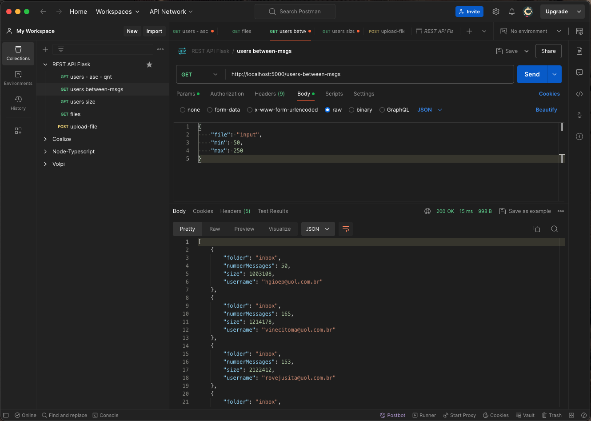
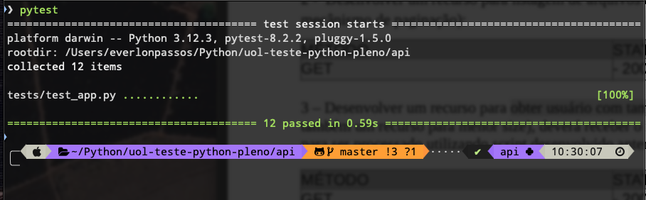

# Teste Python back-end / ShellScript (Linux Bash)

## Documentação

#### Rodar aplicação flask.

`$ flask --app api/app run --debug`

** Arquivos Shell Scripts / Bash **

  - `$ ./between-msgs.sh input 50 200` _< arquivo min max >_
  - `$ ./max-min-size.sh input` _< arquivo -min(op) >_
  - `$ ./order-by-username.sh input -desc` _< arquivo -desc(op) |head -n 5 >_

** API Python/Flask **

Rotas:

  - [GET] `/`  Boas-vindas. (ret: 200)
  - [POST] `/upload-file` Upload de arquivo. (ret: 200, 204, 400)
  - [GET] `/files` Listar arquivos armazenados. (200, 204)
  - [GET] `/users-size` Usuários com maior size. (200, 404)
  - [GET] `/users` Usuários com opções. (200, 404)
  - [GET] `/users-between-msgs` Trecho com quantidade de mensagens na INBOX.

#### Autenticação e Autorização

> Não fiz um sistema completo com DB e SQLAlchemy, mas somente um exemplo de como colocar autenticação e autorização por JWT Token com Flask-JWT-Extended. Coloquei as rotas protegidas com excessão a de "Boas-vindas" e "Login" (claro).

- [POST] `/login` [teste/123456] Acesso com retorno do TokenJWT (Bearer Token).

### Test

Testando ShellScripts:

`$ cd scripts/bash/tests`

Testando API Python/Flask

`$ pytest`

